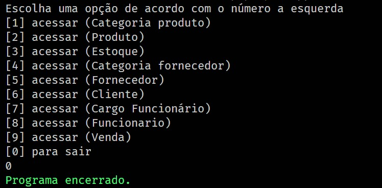
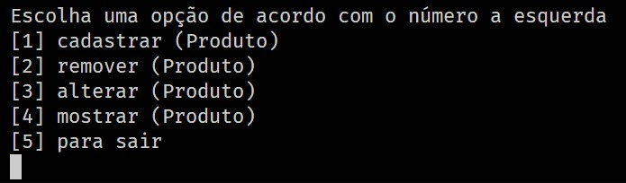
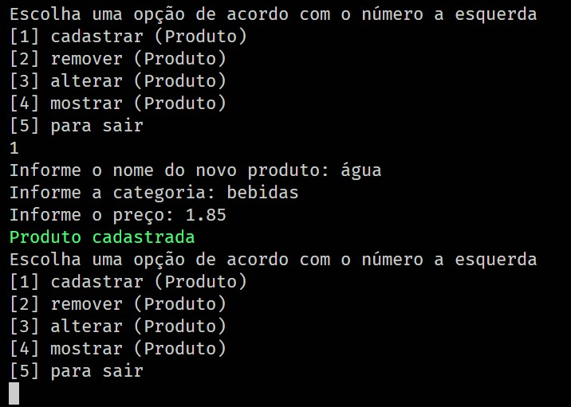
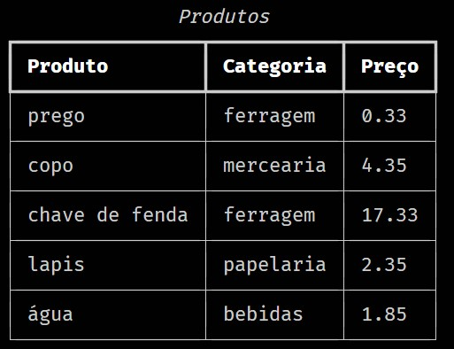
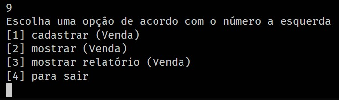
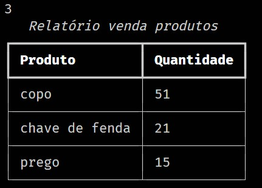

<p align="center">
  <a href="#-tecnologias">Tecnologias</a>&nbsp;&nbsp;&nbsp;|&nbsp;&nbsp;&nbsp;
  <a href="#-projeto">Projeto</a>&nbsp;&nbsp;&nbsp;|&nbsp;&nbsp;&nbsp;
  <a href="#-como-executar">Como executar</a>
</p>


<hr>

<a id="-tecnologias"></a>

## Tecnologias

Esse projeto foi desenvolvido com a seguinte tecnologia:


<hr>

<a id="-projeto"></a>

## 💻 Projeto

O projeto Mercearia-MVC foi desenvolvido apenas com a intenção de exercitar o conhecimento na arquitetura de sistema MVC.

<p align="center">
  
</p>

<p align="center">
  
</p>

<p align="center">
  
</p>

<p align="center">
  
</p>

<p align="center">
  
</p>

<p align="center">
  
</p>

<a id="-como-executar"></a>

## 🚀 Como executar

### 💻 Pré-requisitos
 **Antes de começar, verifique se você atendeu aos seguintes requisitos:**

- Você tem uma máquina `< Windows / Linux / Mac >`.

- Você tem python na versão 3.11 ou superior instalado em sua máquina.


### Como instalar localmente:

- clone ou baixe o repositório.

Com o ambiente virtual ativo:

- Acesse a pasta do projeto no terminal execute:

```console
python -m pip install poetry
poetry install
```

## 👨‍💻 Ativando a aplicação (localmente)
Para executar a aplicação(Com o ambiente virtual ativo):

- Acesse a pasta do projeto no terminal execute:
```console
python view.py
```
